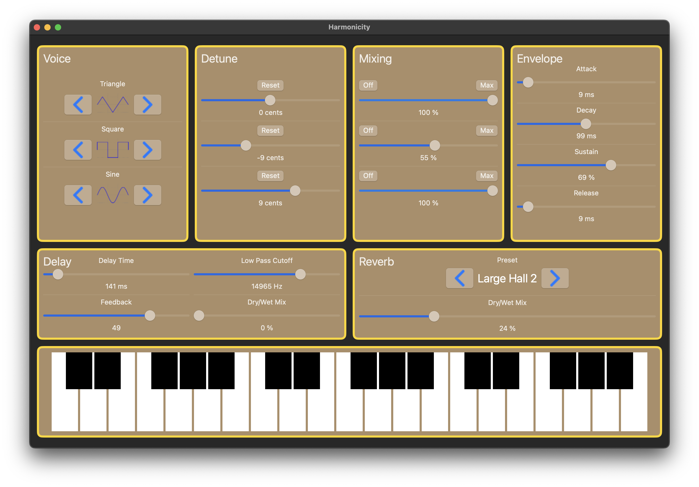

# Harmonicity

Harmonicity is a polyphonic synthesizer for macOS, crafted with SwiftUI and powered by AVAudioEngine. It offers a customizable sound experience with MIDI input handling and a suite of post-processing effects.

# Features

- Polyphonic: Play multiple notes simultaneously for complex harmonies.
  
- Triple Oscillators per Voice: Each voice is built upon three independent oscillators, allowing for intricate sound design.
  
- Individual Oscillator Control:
    * Detune: Adjust the pitch of each oscillator for subtle or extreme sonic variations.
    * Mix Impact: Control the volume contribution of each oscillator to the overall voice.
      
- ADSR Envelope: Shape the amplitude of each voice with Attack, Decay, Sustain, and Release controls.
  
- MIDI Input: Seamlessly connect your MIDI controller to play notes.
  
- Post-Processing Effects:
    * Delay: Add echoes and spacial depth to your sound.
    * Reverb: Create realistic room and hall simulations.
 
# Contributing

Contributions are welcome! If you have suggestions for improvements, new features, or bug fixes, please open an issue or submit a pull request.

# License

This project is licensed under the MIT License.
